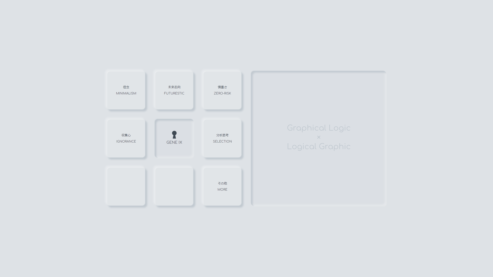
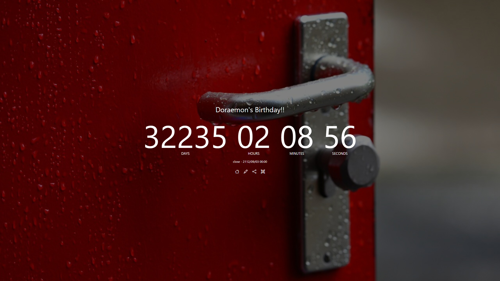
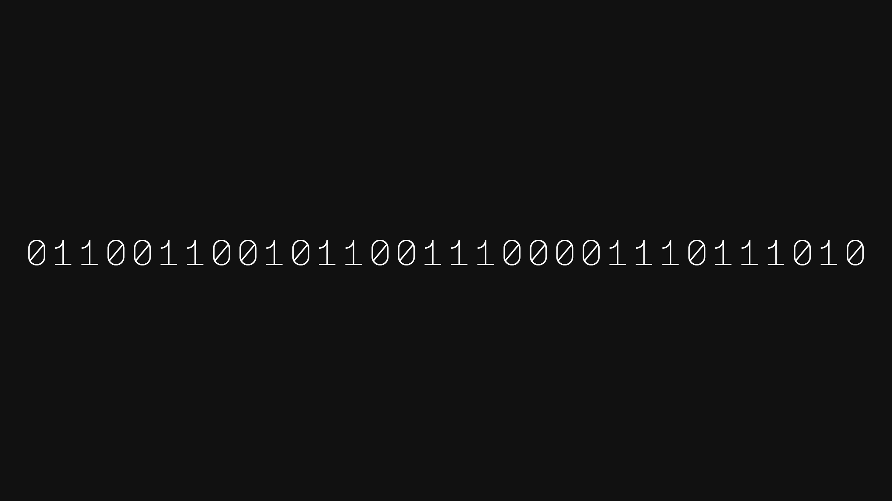
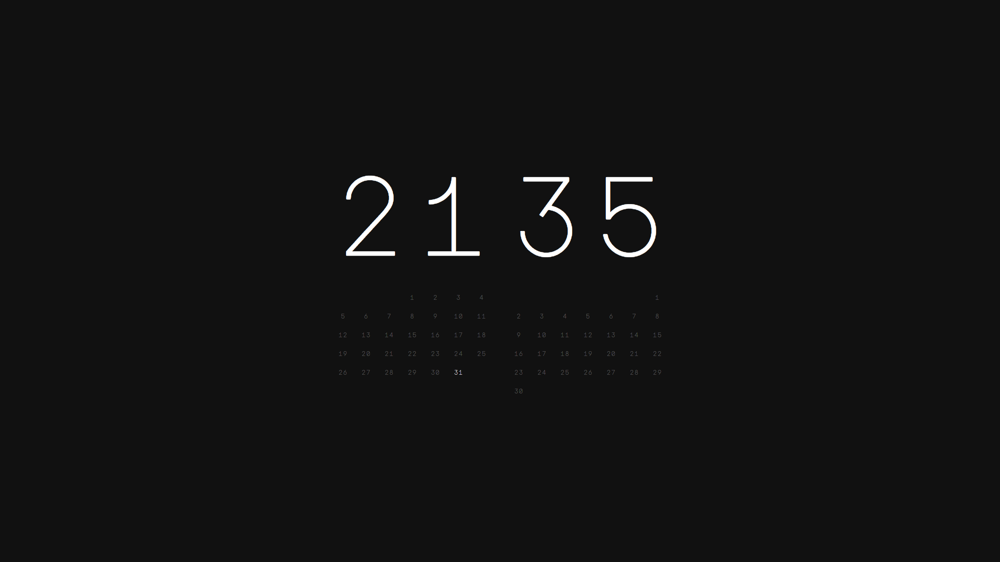
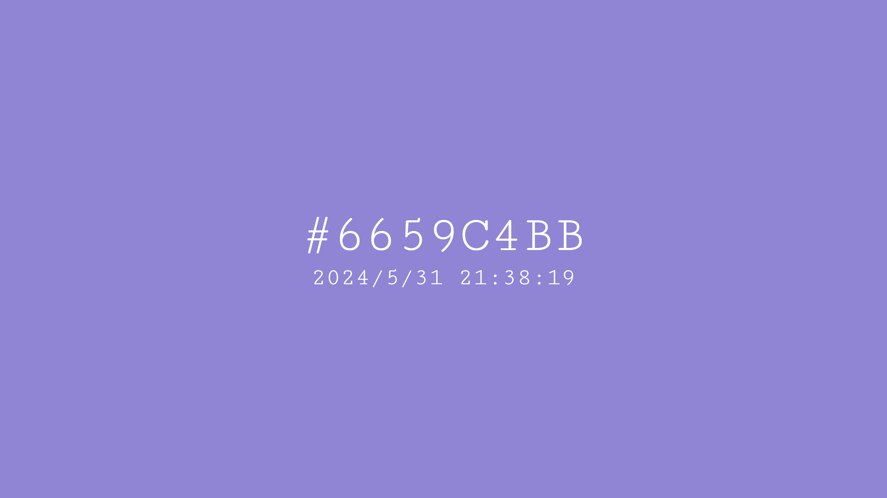
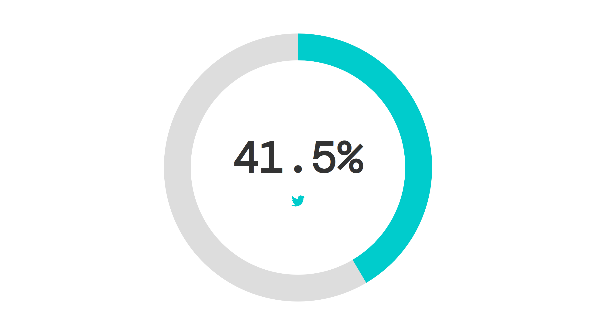

## 👋WELCOME

https://gene-ix.github.io/iam/  
好きな演算子は三項演算子です！  

* **C#**  
* **HTML**  
* **CSS** ( SCSS, Bootstrap, Tailwind )  
* **JavaScript** ( Node.js, React.js, Vue.js, Dart )  
* **PHP** ( Laravel, Wordpress )  
* **SQL** ( MySQL )    
* **AWS** ( CLF-C02 )  
* **National Anthem** ( 30 countries )

## 📚️INPUT

C#から始めて、web系にシフトし、現在はUI/UXデザイナーを目指して勉強中です。

人工知能にも興味があます。  
脳科学などの「テクノロジー」だけではなく「思考プロセス」の側面からもアプローチするために、近～現代哲学から派生していろいろインプットしています。  
思考プロセスの知識ははUI/UXにも重要です。  

## 🎨CREATE

[I am](https://github.com/gene-ix/iam)

ポモドーロタイマー

カウントダウンメーカー

[2038](https://github.com/gene-ix/2038)

[Simple Calendar](https://github.com/gene-ix/simplecalendar)

[Color Clock](https://github.com/gene-ix/color-clock1)

[Dot Clock](https://github.com/gene-ix/dot-clock)

[This Year](https://github.com/gene-ix/thisyear)
